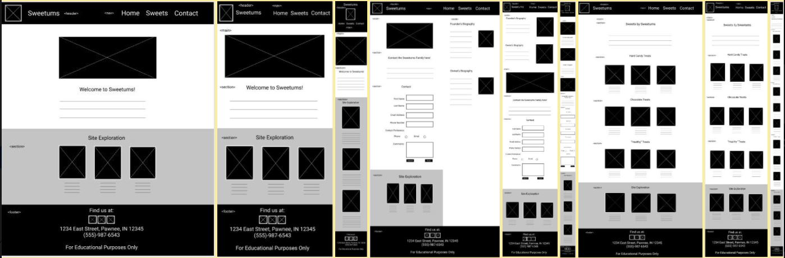
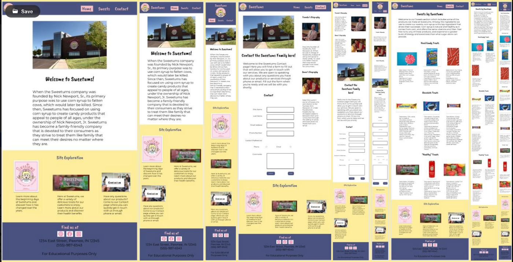

# Sweetums

In this project, I worked with a fictional client to create a responsive website that would appeal to their target audience. Using the company's guidelines that were
provided, I created a three-page website that gave the audience a chance to learn more about the client and their products. 

I had to start by gathering information about the client. There was some information provided to me as part of the class project, but since the fictional client was
from a TV show, I did further research online about their products and their goals. 

After this, I began to create the wireframes of the website using Figma. Since this was a responsive site, I needed mockups on mobile, tablet, and desktop for each of
the three pages of the site. Here is what the wireframes turned out: 

Then I began to use image assets I found online from sources such as Unsplash, Pexels, and Google. Here is what I set myself up to develop: 

At this point, I began to code the website in HTML and CSS. I had to make several revisions in my code as I tried to make my code semantic. I mainly relied on
w3schools.com in writing semantic HTML and CSS. Once I had the mobile viewpoints done on each page, I started to work on adjusting the pages to their tablet and desktop
versions. In the end, there were a few changes I had to make from my mockups, but I was able to make the site responsive using the three viewpoints. I was able to get 
an 147/150 as my grade for the final submission. This taught me a lot about making semantic and responsive websites, and gave me some experience on what it would be 
like to make a website for a client. 
